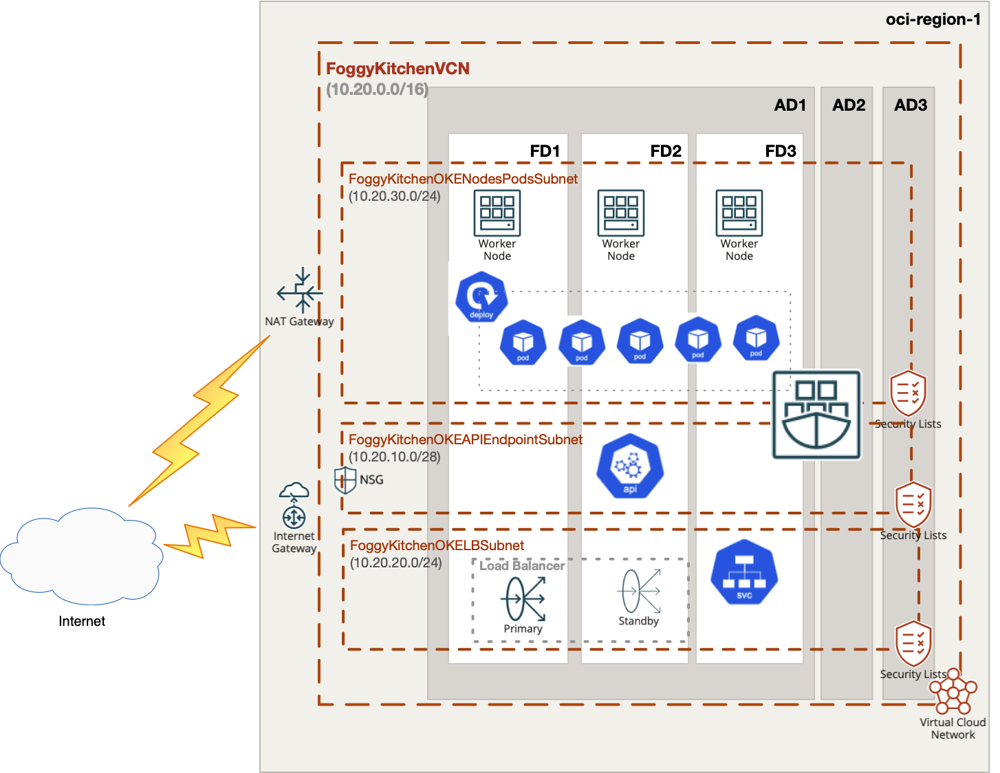

# OCI Container Engine for Kubernetes (aka OCI OKE) with Native POD networking

## Project description

In this repository, I have documented my hands on experience with Terrafrom for the purpose of Container Engine for Kubernetes (aka OCI OKE) deployment with Native POD networking. This set of HCL based Terraform files which can customized according to any requirements.  

## Topology Diagram 

With the usage of this example HCL code you can build topology documented by diagram below. This topology is extremly simplified for education purposes and rather cannot be used for production implementations. 



## How to use code 

### Deploy Using Oracle Resource Manager

1. Click [](https://cloud.oracle.com/resourcemanager/stacks/create?region=home&zipUrl=https://github.com/mlinxfeld/terraform-oci-oke-native-pod-networking/releases/latest/download/terraform-oci-oke-native-pod-networking-stack-latest.zip)

    If you aren't already signed in, when prompted, enter the tenancy and user credentials.

2. Review and accept the terms and conditions.

3. Select the region where you want to deploy the stack.

4. Follow the on-screen prompts and instructions to create the stack.

5. After creating the stack, click **Terraform Actions**, and select **Plan**.

6. Wait for the job to be completed, and review the plan.

    To make any changes, return to the Stack Details page, click **Edit Stack**, and make the required changes. Then, run the **Plan** action again.

7. If no further changes are necessary, return to the Stack Details page, click **Terraform Actions**, and select **Apply**. 

### Deploy Using the Terraform CLI

#### STEP 1.

Clone the repo from GitHub.com by executing the command as follows and then go to terraform-oci-private-oke directory:

```
[opc@terraform-server ~]$ git clone https://github.com/mlinxfeld/terraform-oci-oke-native-pod-networking.git
Cloning into 'terraform-oci-oke-native-pod-networking'...
remote: Enumerating objects: 10, done.
remote: Counting objects: 100% (10/10), done.
remote: Compressing objects: 100% (10/10), done.
remote: Total 10 (delta 0), reused 10 (delta 0), pack-reused 0
Unpacking objects: 100% (10/10), done.

[opc@terraform-server ~]$ cd terraform-oci-oke-native-pod-networking/

[opc@terraform-server terraform-oci-oke-native-pod-networking]$ ls -latr

-rw-r--r--@  1 opc opc  13187 Jun 11 10:54 README.md
-rw-r--r--   1 opc opc    197 Jun 11 10:54 compartment.tf
-rw-r--r--   1 opc opc  10345 Jun 11 10:54 schema.yaml
-rw-r--r--@  1 opc opc 690081 Jun 11 10:54 terraform-oci-oke-native-pod-networking.jpg
-rw-r--r--   1 opc opc     80 Jun 11 10:54 tls.tf
drwxr-xr-x   3 opc opc     96 Jun 11 11:21 templates
-rw-r--r--   1 opc opc    743 Jun 11 11:23 provider.tf
-rw-r--r--   1 opc opc    892 Jun 11 12:35 outputs.tf
-rw-r--r--   1 opc opc    614 Jun 11 12:45 .gitignore
-rw-r--r--   1 opc opc   1359 Jun 12 09:52 locals.tf
-rw-r--r--   1 opc opc   1601 Jun 12 09:53 datasources.tf
-rw-r--r--   1 opc opc  13438 Jun 12 11:17 network.tf
-rw-r--r--   1 opc opc   2655 Jun 12 11:33 oke.tf
-rw-r--r--   1 opc opc   2955 Jun 12 11:48 oke_policy.tf
-rw-r--r--   1 opc opc   2269 Jun 12 13:28 variables.tf
```

#### STEP 2.

Within web browser go to URL: https://www.terraform.io/downloads.html. Find your platform and download the latest version of your terraform runtime. Add directory of terraform binary into PATH and check terraform version:

```
[opc@terraform-server terraform-oci-oke-native-pod-networking]$ export PATH=$PATH:/home/opc/terraform

[opc@terraform-server terraform-oci-oke-native-pod-networking]$ terraform --version

Terraform v1.0.0

Your version of Terraform is out of date! The latest version
is 1.2.2. You can update by downloading from https://www.terraform.io/downloads.html
```

#### STEP 3. 
Next create environment file with TF_VARs:

```
[opc@terraform-server terraform-oci-oke-native-pod-networking]$ vi setup_oci_tf_vars.sh
export TF_VAR_user_ocid="ocid1.user.oc1..aaaaaaaaob4qbf2(...)uunizjie4his4vgh3jx5jxa"
export TF_VAR_tenancy_ocid="ocid1.tenancy.oc1..aaaaaaaas(...)krj2s3gdbz7d2heqzzxn7pe64ksbia"
export TF_VAR_compartment_ocid="ocid1.tenancy.oc1..aaaaaaaasbktyckn(...)ldkrj2s3gdbz7d2heqzzxn7pe64ksbia"
export TF_VAR_fingerprint="00:f9:d1:41:bb:57(...)82:47:e6:00"
export TF_VAR_private_key_path="/tmp/oci_api_key.pem"
export TF_VAR_region="eu-frankfurt-1"
export TF_VAR_private_key_oci="/tmp/id_rsa"
export TF_VAR_public_key_oci="/tmp/id_rsa.pub"

[opc@terraform-server terraform-oci-oke-native-pod-networking]$ source setup_oci_tf_vars.sh
```

#### STEP 4.
Run *terraform init* with upgrade option just to download the lastest neccesary providers:

```
[opc@terraform-server terraform-oci-oke-native-pod-networking]$ terraform init 

Initializing the backend...

Initializing provider plugins...
- Finding latest version of hashicorp/null...
- Finding latest version of hashicorp/template...
- Finding latest version of oracle/oci...
- Finding latest version of hashicorp/random...
- Finding latest version of hashicorp/tls...
- Finding latest version of hashicorp/local...
- Installing hashicorp/template v2.2.0...
- Installed hashicorp/template v2.2.0 (signed by HashiCorp)
- Installing oracle/oci v4.84.0...
- Installed oracle/oci v4.84.0 (signed by a HashiCorp partner, key ID 1533A49284137CEB)
- Installing hashicorp/random v3.3.1...
- Installed hashicorp/random v3.3.1 (signed by HashiCorp)
- Installing hashicorp/tls v3.4.0...
- Installed hashicorp/tls v3.4.0 (signed by HashiCorp)
- Installing hashicorp/local v2.2.3...
- Installed hashicorp/local v2.2.3 (signed by HashiCorp)
- Installing hashicorp/null v3.1.1...
- Installed hashicorp/null v3.1.1 (signed by HashiCorp)

Partner and community providers are signed by their developers.
If you'd like to know more about provider signing, you can read about it here:
https://www.terraform.io/docs/cli/plugins/signing.html

Terraform has created a lock file .terraform.lock.hcl to record the provider
selections it made above. Include this file in your version control repository
so that Terraform can guarantee to make the same selections by default when
you run "terraform init" in the future.

Terraform has been successfully initialized!

You may now begin working with Terraform. Try running "terraform plan" to see
any changes that are required for your infrastructure. All Terraform commands
should now work.

If you ever set or change modules or backend configuration for Terraform,
rerun this command to reinitialize your working directory. If you forget, other
commands will detect it and remind you to do so if necessary.
```

#### STEP 5.
Run *terraform apply* to provision the content of this repo (type **yes** to confirm the the apply phase):

```
[opc@terraform-server terraform-oci-oke-native-pod-networking]$ terraform apply

Terraform used the selected providers to generate the following execution plan. Resource actions are indicated with the following symbols:
  + create
 <= read (data resources)

Terraform will perform the following actions:

(...)

Plan: 27 to add, 0 to change, 0 to destroy.

Changes to Outputs:
  + cluster_instruction = (known after apply)

Do you want to perform these actions?
  Terraform will perform the actions described above.
  Only 'yes' will be accepted to approve.

  Enter a value: yes


random_id.tag: Creating...
random_id.tag: Creation complete after 0s [id=54Y]
tls_private_key.public_private_key_pair: Creating...
tls_private_key.public_private_key_pair: Creation complete after 0s [id=6ad8987d7d0e47c7a06caf57798c706c8d2cbd41]
oci_identity_tag_namespace.FoggyKitchenClusterTagNamespace: Creating...
oci_identity_compartment.FoggyKitchenCompartment: Creating...

(...)

oci_containerengine_node_pool.FoggyKitchenOKENodePool: Still creating... [5m40s elapsed]
oci_containerengine_node_pool.FoggyKitchenOKENodePool: Still creating... [5m50s elapsed]
oci_containerengine_node_pool.FoggyKitchenOKENodePool: Still creating... [6m0s elapsed]
oci_containerengine_node_pool.FoggyKitchenOKENodePool: Still creating... [6m10s elapsed]
oci_containerengine_node_pool.FoggyKitchenOKENodePool: Still creating... [6m20s elapsed]
oci_containerengine_node_pool.FoggyKitchenOKENodePool: Creation complete after 6m28s [id=ocid1.nodepool.oc1.eu-amsterdam-1.aaaaaaaaptdn62wncajzgqj6bo23uv5vdbv4vmbruakn3lxwdnswa4xp34iq]

Apply complete! Resources: 19 added, 0 changed, 0 destroyed.

Outputs:

cluster_instruction = <<EOT
1.  Open OCI Cloud Shell.

2.  Execute below command to setup OKE cluster access:

$ oci ce cluster create-kubeconfig --region eu-amsterdam-1 --cluster-id ocid1.cluster.oc1.eu-amsterdam-1.aaaaaaaa74sp2j53tgbnlxmb7fhn62lj4dspxwdukvz3eghvkch4yi2o7tka

3.  Create NGINX deployment:

$ kubectl create -f nginx.yaml

4.  Get POD name:

$ kubectl get pods

5.  Verfiy PODs IPs:

$ kubectl describe  pods | grep '  IP:'

EOT
```

#### STEP 6.
After testing the environment you can remove the OCI OKE infra. You should just run *terraform destroy* (type **yes** for confirmation of the destroy phase):

```
[opc@terraform-server terraform-oci-oke-native-pod-networking]$ terraform destroy -auto-approve

data.oci_containerengine_node_pool_option.FoggyKitchenOKEClusterNodePoolOption: Refreshing state...
(…)

Destroy complete! Resources: 19 destroyed.
```
